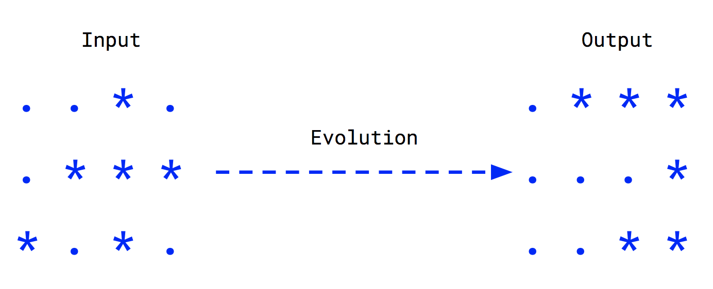

# Conway's Game of Life

## Long in short

* Board where each cell can have two possible states:
  * Alive
  * Dead
* The goal is to calculate the next generation of the board by taking into account 4 rules (see below).

Important: not needed to implement a GUI.

## The 4 rules

* Any alive cell with less than 2 alive neighbours, dies (underpopulation)
* Any alive cell with more than 3 alive neighbours, dies (overpopulation)
* Any alive cell with exactly 2 or 3 alive neighbours, keeps being alive in the next generation.
* Any dead cell with exactly 3 alive neighbours, becomes alive in the next generation.

## Example

Note: we assume that the evolution affects all the cells simultaneously.

Happy hacking! :)
